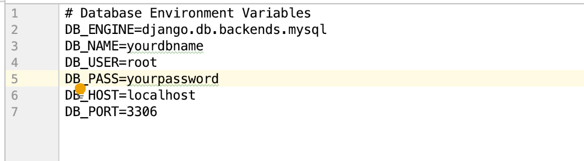
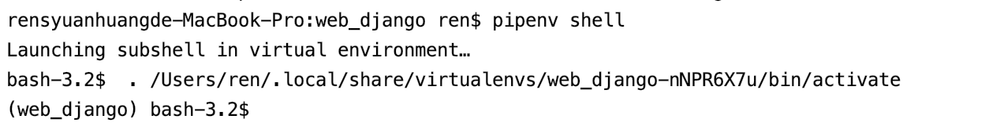
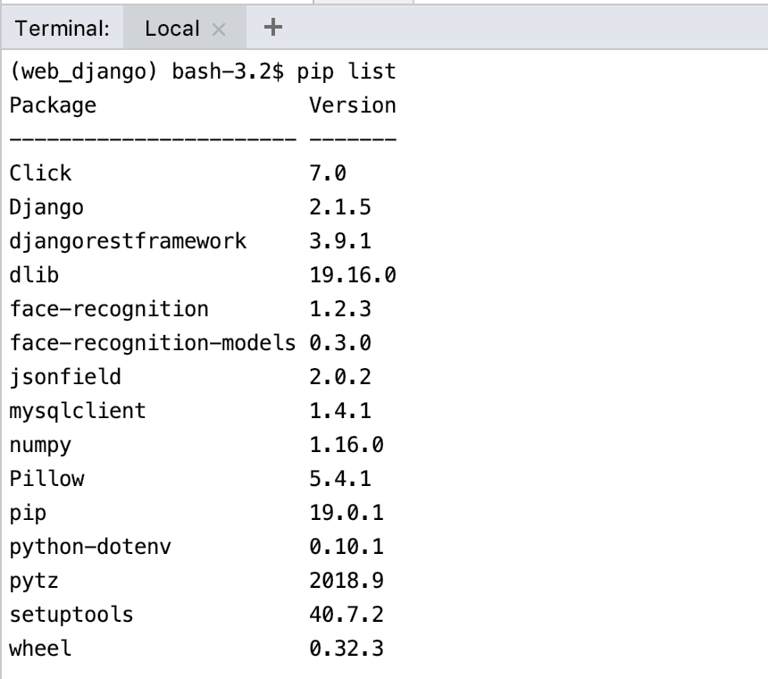
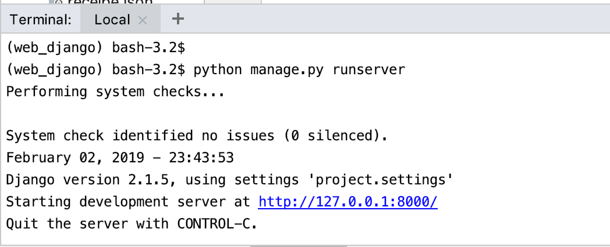

# Web with Django
## Installation
>**[Pipenv](https://github.com/pypa/pipenv)** is a tool that aims to bring the best of all packaging worlds to the 
Python world.It automatically creates and manages a virtualenv for your projects, as well as adds/removes packages 
from your Pipfile as you install/uninstall packages.
>>*Pipenv = pip + virtualenv*<br>

**Requirements**

* Python 3.6
* pipenv 
* Mysql

**Installing on Mac**<br>

1.Install pipenv<br>
On MacOS, you can easily install Pipenv  with Homebrew:
```
brew install pipenv
```
2.Install Mysql<br>
On MacOS, you can easily install Mysql with Homebrew:
```
brew install mysql
```
Before setup username, password of Mysql, active mysql server is 
required, which will generate socket file (under '/tmp/mysql.sock'):
```
mysql.server start
```
Set up your username, password of database, please don't forget!
```
mysql_secure_installation
```
Remember to activate mysql server while run Django Web server.

3.clone project
```
git clone https://github.com/ai-fridge/web.git
```

4.Install required packages in Pipfile<br>
After installing all packages, you can synchronize with the developing environment.
```
cd web 
pipenv install
```
## Usage
**Modify config file dev.env**

One of the features of Pipenv is to automatically load .env files, if they exist. In this project, we setup 
parameters of database in dev.env file, modify them to fit your own mysql database:


**Activate the virtualenv**<br>
`pipenv shell`<br>


**Checkout installed packages under virtualenv**
```
pip list
```


**Run localhost Django Web server**<br>
`python manage.py runserver`


## Django structure

